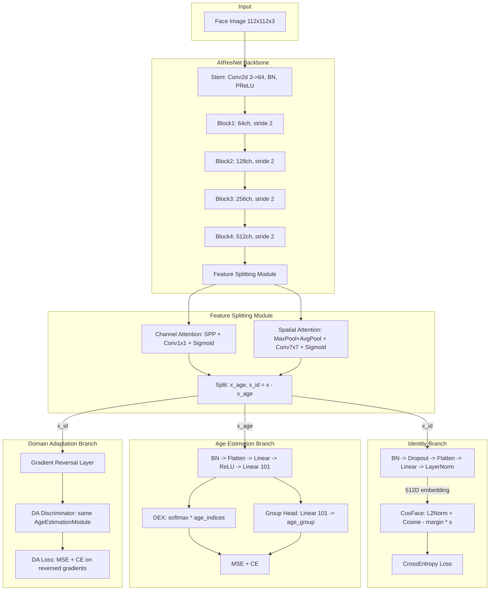
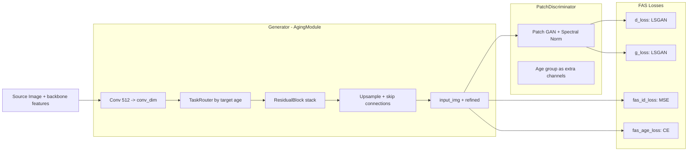
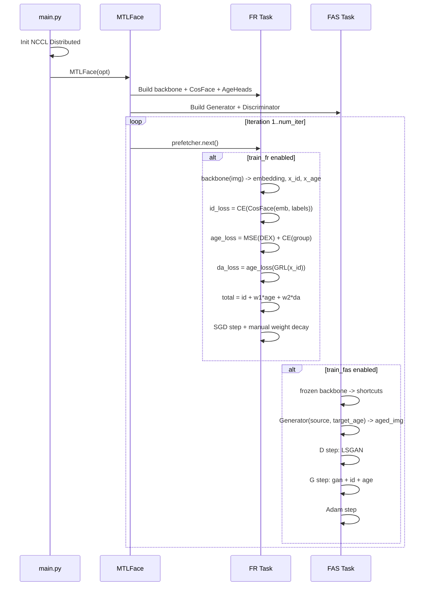
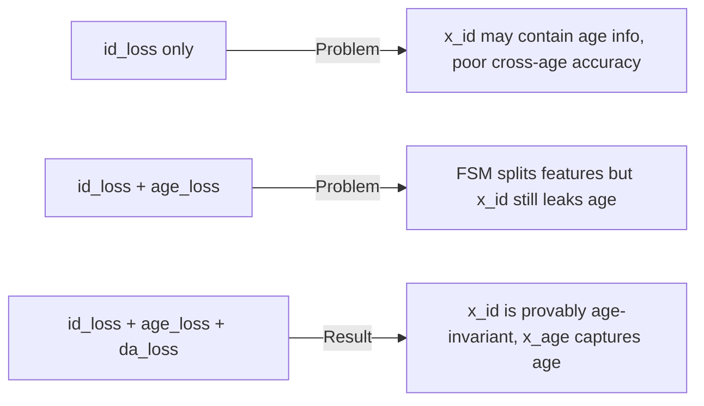

# MTLFace - Architecture, Training Flow, Datasets & Metrics

**Paper:** *When Age-Invariant Face Recognition Meets Face Age Synthesis: A Multi-Task Learning Framework*
**Venue:** CVPR 2021 (Oral) | TPAMI 2022 (Journal Extension)
**arXiv:** https://arxiv.org/abs/2103.01520

---

## 1. Overview

MTLFace is a multi-task learning framework that jointly handles two tasks:

- **AIFR** (Age-Invariant Face Recognition): extracts identity features that are invariant to age variation
- **FAS** (Face Age Synthesis): generates face images at different target ages while preserving identity

The key idea is to decompose face features into **identity-related** and **age-related** components through an attention-based Feature Splitting Module (FSM), then decorrelate them via multi-task training with domain adaptation.

### Why Multi-Task Learning?

Previous approaches tackled AIFR and FAS separately:
- **AIFR-only** methods extract age-invariant features but lack visual interpretability (no synthesized images to verify what the model learned).
- **FAS-only** methods generate aged/de-aged faces but introduce artifacts that hurt downstream recognition accuracy.

MTLFace unifies both: the recognition branch provides a strong identity signal that guides the synthesis branch, while the synthesis branch provides visual feedback and data augmentation that improves recognition. The shared backbone ensures both tasks benefit from each other's gradients.

---

## 2. Architecture Diagram



---

## 3. Backbone: AIResNet

**Files:** `backbone/aifr.py`, `backbone/irse.py`

### 3.1 Why IR-ResNet?

IR-ResNet (Improved ResNet) from InsightFace/ArcFace is the de facto standard backbone for face recognition. Compared to vanilla ResNet:

- Uses **PReLU** instead of ReLU, allowing negative activations which better model subtle facial features.
- Uses **BN-before-conv** ordering (pre-activation) instead of conv-BN-ReLU, which improves gradient flow and produces more discriminative face embeddings.
- Uses **3x3 stem** (stride 1) instead of 7x7 stem (stride 2) to preserve spatial details critical for 112x112 face images (which are already small).
- Proven to achieve state-of-the-art face recognition accuracy in ArcFace, CosFace, and other benchmarks.

### 3.2 Network Structure

| Layer | Output Channels | Stride | Description |
|-------|----------------|--------|-------------|
| **Stem** | 64 | 1 | `Conv2d(3, 64, 3x3)` + `BatchNorm2d` + `PReLU` |
| **Block1** | 64 | 2 | Bottleneck IR blocks (first block stride 2) |
| **Block2** | 128 | 2 | Bottleneck IR blocks |
| **Block3** | 256 | 2 | Bottleneck IR blocks |
| **Block4** | 512 | 2 | Bottleneck IR blocks |
| **FSM** | 512 | - | Attention-based feature splitting |
| **Output** | 512 | - | `BN` + `Dropout` + `Flatten` + `Linear` + `LayerNorm` |

### 3.3 Available Variants

| Name | Layers per Stage | Block Type | Why Use |
|------|-----------------|------------|---------|
| `ir34` | [3, 4, 6, 3] | IR | Lightweight, fast training/inference |
| **`ir50`** | [3, 4, 14, 3] | IR | **Default choice** - best accuracy/speed trade-off |
| `ir64` | [3, 4, 10, 3] | IR | Mid-range between ir50 and ir101 |
| `ir101` | [3, 13, 30, 3] | IR | Higher capacity for larger datasets |
| `irse101` | [3, 13, 30, 3] | IR-SE | SE attention recalibrates channels for marginal gain |

### 3.4 Bottleneck IR Block

```
Input -> BN -> Conv2d(3x3) -> BN -> PReLU -> Conv2d(3x3) -> BN -> + -> Output
  |                                                                ^
  +--- shortcut (MaxPool or Conv1x1 when channels change) --------+
```

**Why this design:**
- **Pre-activation BN** stabilizes training for deep face networks.
- **Residual shortcuts** allow training very deep networks (50-100+ layers) without vanishing gradients.
- The IR-SE variant adds a **Squeeze-and-Excitation** module (channel reduction 16) that recalibrates channel-wise feature responses, giving ~0.1-0.3% accuracy improvement at marginal compute cost.

### 3.5 Feature Splitting Module (AttentionModule)

**Why split features?**

Face images contain entangled identity and age information. A 30-year-old and 60-year-old version of the same person share identity features (bone structure, eye shape) but differ in age features (wrinkles, skin texture). The FSM learns to disentangle these:

- `x_age` captures age-related appearance (wrinkles, skin condition, hair color changes)
- `x_id` captures age-invariant identity (facial geometry, distinctive features)

**How it works:**

**Channel Attention** - selects *which* feature channels encode age:
- SPP (Spatial Pyramid Pooling) with sizes (1, 2, 3) using both avg and max pooling captures multi-scale global statistics
- `Conv1x1` -> `ReLU` -> `Conv1x1` -> `GroupNorm(32)` -> `Sigmoid` produces per-channel weights

**Spatial Attention** - selects *where* in the feature map age information resides:
- Max and Mean pooling over channels -> stack (2 channels)
- `Conv2d(7x7)` -> `GroupNorm(1)` -> `Sigmoid` produces per-pixel weights

**Why GroupNorm instead of BatchNorm?** At small spatial resolutions (7x7) and potentially small batch sizes, BatchNorm statistics become unreliable. GroupNorm normalizes within each sample, making it batch-size independent.

**Feature Split:**
```python
x_age = (x * channel_scale + x * spatial_scale) * 0.5   # weighted average of channel and spatial attention
x_id  = x - x_age                                        # residual: everything not age-related is identity
```

**Why residual split (`x_id = x - x_age`)?** This design ensures completeness: `x_id + x_age = x`, so no information is lost. The network learns to allocate age information to `x_age`, and everything remaining (identity) stays in `x_id`.

### 3.6 Output Layer

```python
nn.BatchNorm2d(512) -> nn.Dropout() -> nn.Flatten() -> nn.Linear(512*49, 512) -> nn.LayerNorm(512)
```

**Why LayerNorm instead of BatchNorm1d?** The original IResNet uses `BatchNorm1d(512)`, but BatchNorm fails when batch_size=1 (inference). LayerNorm normalizes per-sample over the 512-dim embedding, working with any batch size. This is important for single-image inference at test time.

---

## 4. Heads and Loss Functions

### 4.1 CosFace (Identity Recognition)

**File:** `head/cosface.py`

**What it does:**
```python
cosine = F.linear(F.normalize(input), F.normalize(weight))    # cosine similarity
output = s * (cosine - m * one_hot(label))                     # subtract margin from target class
id_loss = CrossEntropy(output, label)
```

| Parameter | Default | Description |
|-----------|---------|-------------|
| `s` | 64.0 | Scale factor |
| `m` | 0.35 | Cosine margin |
| `in_features` | 512 | Embedding dimension |
| `out_features` | num_classes | Number of identity classes |

**Why CosFace over standard softmax?**
- Standard softmax learns separable features but not discriminative enough for face verification (open-set problem).
- CosFace adds a **cosine margin** `m` to the target class: the network must make `cos(theta_y) - m > cos(theta_j)` for all other classes `j`. This forces embeddings to be more tightly clustered per identity and more widely separated between identities.
- Operating in **cosine space** (L2-normalized features and weights) removes the effect of feature magnitude, focusing purely on angular discrimination. This is critical because face verification at test time uses cosine similarity between embeddings.

**Why CosFace over ArcFace?**
- CosFace (additive cosine margin: `cos(theta) - m`) is simpler and more numerically stable than ArcFace (additive angular margin: `cos(theta + m)`).
- ArcFace requires clamping to avoid `acos` domain errors; CosFace avoids this entirely.
- Performance difference is marginal (<0.1%) on most benchmarks.

**Why s=64?** The scale factor amplifies logit magnitudes before softmax. Too small -> softmax becomes uniform (no learning signal). Too large -> training becomes unstable. s=64 is the standard value empirically validated across ArcFace/CosFace literature.

**Why m=0.35?** The margin controls how hard the classification task is. Higher margin -> more discriminative but harder to converge. m=0.35 is the CosFace paper's recommended default, validated on large-scale face benchmarks.

### 4.2 Age Estimation Module (DEX-style)

**File:** `backbone/aifr.py` - `AgeEstimationModule`

```
x_age -> BN2d(512) -> Flatten -> Linear(512*49, 512) -> ReLU -> Linear(512, 101) -> age_logits
x_group = Linear(101, age_group)(age_logits)
```

**Why DEX (Deep EXpectation)?**

```python
predicted_age = sum(softmax(age_logits) * [0, 1, 2, ..., 100])
```

Instead of directly regressing a single age value, DEX treats age estimation as a 101-class classification problem (ages 0-100), then computes the expected value. This is superior because:

1. **Softmax distribution captures uncertainty**: A 35-year-old might have predictions peaked at 33-37, reflecting natural ambiguity in apparent age.
2. **Better gradient flow**: Classification loss provides gradients for all 101 output neurons, while regression only updates one scalar. This gives richer learning signals.
3. **Handles label noise**: Apparent age is inherently noisy (annotators disagree by ~5 years). Soft distributions are more robust than hard regression targets.
4. **Non-linear age mapping**: The network can learn non-uniform age distributions (e.g., it's easier to distinguish a 10-year-old from a 20-year-old than a 40-year-old from a 50-year-old).

**Why combine MSE + CrossEntropy for age loss?**

```python
age_loss = MSE(predicted_age, gt_age) + CrossEntropy(x_group, age2group(age))
```

- **MSE on continuous age**: Penalizes the expected value directly, ensuring predicted_age is close to ground truth. This handles fine-grained age differences.
- **CE on age groups**: Provides a coarser but stronger supervisory signal. Group boundaries (e.g., 10, 20, 30...) act as anchor points that stabilize early training. Groups also directly map to the FAS task's conditioning signal.

### 4.3 Age Group Mapping

**File:** `common/ops.py`

| `age_group` | Boundaries | Groups |
|-------------|-----------|--------|
| **7** (default) | [10, 20, 30, 40, 50, 60] | 0-9, 10-19, 20-29, 30-39, 40-49, 50-59, 60+ |

**Why 7 age groups?** This provides a good balance:
- **Too few groups** (e.g., 4): loses granularity, the FAS generator can't produce meaningful age differences within a group.
- **Too many groups** (e.g., 12): insufficient training samples per group, and visual differences between adjacent groups become imperceptible.
- **7 groups with 10-year bins** aligns with visible aging stages: child (0-9), teen (10-19), young adult (20-29), adult (30-39), middle-aged (40-49), senior (50-59), elderly (60+).

### 4.4 Domain Adaptation (Gradient Reversal Layer)

**File:** `common/grl.py`

**What it does:**
- Forward: `GRL(x) = x` (identity function)
- Backward: `d(GRL)/dx = -lambda * I` (negated gradients)

```python
da_loss = compute_age_loss(da_discriminator(GRL(x_id)), ages)
```

**Why Gradient Reversal?**

The FSM's residual split (`x_id = x - x_age`) does not guarantee that `x_id` is truly age-free. Some age information may leak into `x_id`. The GRL provides an **adversarial guarantee**:

1. The DA discriminator tries to predict age from `x_id` (same architecture as the age estimation module).
2. The GRL reverses gradients flowing back to the backbone: when the discriminator gets better at predicting age from `x_id`, the backbone receives gradients that **remove** age information from `x_id`.
3. At equilibrium, `x_id` contains no age information that the discriminator can exploit -> **provably age-invariant** identity features.

This is the same principle as Domain-Adversarial Neural Networks (DANN), but applied to continuous age domains rather than discrete domains.

**Why not just rely on the FSM attention?** The FSM provides a soft, differentiable split but has no explicit constraint preventing age leakage into `x_id`. The GRL adds a hard adversarial constraint that provably minimizes mutual information between `x_id` and age.

### 4.5 FR Total Loss

```python
total_loss = id_loss + 0.001 * age_loss + 0.002 * da_loss
```

| Weight | Default | Why This Value |
|--------|---------|----------------|
| `id_loss` | 1.0 | Primary objective: face recognition accuracy |
| `fr_age_loss_weight` | 0.001 | Small weight: age supervision is auxiliary; too large disrupts identity learning |
| `fr_da_loss_weight` | 0.002 | Slightly larger than age_loss: DA constraint is important for cross-age robustness |

**Why these specific weights?** The identity loss is the primary objective and dominates training. Age and DA losses are auxiliary signals:
- If age_loss_weight is too large, the backbone prioritizes age estimation over identity discrimination.
- If da_loss_weight is too large, the adversarial training becomes unstable (min-max game oscillates).
- The chosen values were determined through ablation studies in the paper.

---

## 5. Face Age Synthesis (FAS)

**Files:** `models/fas.py`, `common/networks.py`



### 5.1 Generator (AgingModule)

**Why this architecture?**

```python
# 1. Compress identity features
x_id = Conv(512 -> conv_dim) -> BN -> PReLU

# 2. TaskRouter selects age-group-specific channels
x_id = TaskRouter(x_id, target_age_group)

# 3. ResidualBlock stack transforms features
x = ResidualBlocks(x_id)  # 4 blocks with TaskRouters inside

# 4. Expand back
x = Conv(conv_dim -> 512) -> BN -> PReLU

# 5. Upsample with skip connections from backbone
x = Upsample(x, x_4)       # 7x7 -> 14x14, concat with block3 features
x = Upsample(x, x_3)       # 14x14 -> 28x28, concat with block2 features
x = Upsample(x, x_2)       # 28x28 -> 56x56, concat with block1 features
x = Upsample(x, input_img)  # 56x56 -> 112x112, concat with original image

# 6. Residual output
output = input_img + Conv(x)  # residual learning
```

**Why TaskRouter?**

The TaskRouter is the key novelty for **identity-level** face aging (vs. group-level). Instead of a single generator for all age groups:

```python
class TaskRouter:
    # Creates overlapping channel masks per age group
    # sigma=0.1 means 10% overlap between adjacent groups
    mask[group_i] = [0, 0, ..., 1, 1, 1, ..., 0, 0]
```

- Each age group activates a **subset of channels** with partial overlap (controlled by sigma=0.1).
- **Overlapping channels** between adjacent groups (e.g., 30-39 and 40-49) enable smooth age transitions - shared channels capture gradual changes, dedicated channels capture group-specific features.
- **Weight sharing** across groups (through overlapping masks) improves data efficiency: features learned for one age group benefit neighboring groups.
- This achieves **continuous aging** even though conditioning is discrete, because overlapping activations interpolate between adjacent group transformations.

**Why skip connections from backbone?**

The generator needs multi-scale spatial details (hair texture, skin pores, background) that are lost in the 7x7 bottleneck. Skip connections from backbone stages (`x_1..x_4` + original image) provide:
- Low-level details (edges, textures) from early layers
- Mid-level structure (facial parts) from middle layers
- The original image itself for pixel-level guidance

**Why residual output (`input_img + x`)?**

Aging only changes a small fraction of pixels (wrinkles, skin color). Residual learning lets the generator focus on **what to change** rather than reconstructing the entire image from scratch. This produces sharper results and converges faster.

### 5.2 PatchDiscriminator

**Why PatchGAN instead of a global discriminator?**

- A global discriminator produces one real/fake score per image, providing weak spatial gradients.
- PatchGAN produces a **grid of scores** (one per receptive field patch), giving spatially-localized feedback: "this patch of skin looks fake" vs. "this patch is realistic."
- This is critical for face aging where changes are local (wrinkles around eyes, forehead lines, nasolabial folds).

**Why Spectral Normalization?**

Spectral normalization constrains the Lipschitz constant of the discriminator to at most 1, which:
- Prevents mode collapse (discriminator becoming too strong too fast)
- Stabilizes GAN training without needing gradient penalty (which is slower)
- Is computationally cheaper than other normalization schemes

**Why condition on age group?**

Age group information is broadcast as extra channels and concatenated to the discriminator's first hidden layer. This makes the discriminator **age-aware**: it learns what a realistic 20-year-old vs. 60-year-old face looks like, providing age-specific adversarial gradients to the generator.

### 5.3 FAS Losses

#### Discriminator Loss (LSGAN)

```python
d_loss = 0.5 * (MSE(D(real_target), 1) + MSE(D(G(source)), 0))
```

**Why LSGAN (Least Squares GAN) instead of standard GAN (BCE)?**

| Property | Standard GAN (BCE) | LSGAN (MSE) |
|----------|-------------------|-------------|
| Gradient vanishing | Yes (saturates for confident samples) | No (quadratic penalty always provides gradients) |
| Training stability | Often unstable | More stable |
| Mode collapse | Common | Less frequent |
| Image quality | Good | Better (penalizes samples far from decision boundary) |

LSGAN penalizes samples proportionally to their distance from the real data manifold, providing meaningful gradients even for well-classified samples.

#### Identity Preservation Loss

```python
fas_id_loss = MSE(x_id_source, x_id_generated)
```

**Why MSE on identity features?**

The generated face must preserve the same identity. Instead of comparing pixels (which change due to aging), we compare identity features extracted by the **frozen** backbone. This ensures the generated face would be recognized as the same person, which is the ultimate goal of age-invariant FR.

**Why freeze the backbone during FAS training?** If the backbone updates during FAS training, the identity features shift, making the MSE target non-stationary. Freezing ensures a stable identity metric.

#### Age Accuracy Loss

```python
fas_age_loss = CrossEntropy(age_estimation(g_x_age)[1], target_age_group)
```

**Why CE on age group (not MSE on continuous age)?**

The generator is conditioned on discrete age groups (via TaskRouter), so the supervisory signal should also be discrete. CE on age groups provides a clearer, stronger gradient than MSE on continuous age: the generated face should clearly belong to the target age group.

#### Combined FAS Generator Loss

```python
total_g = 75 * g_loss + 0.002 * fas_id_loss + 10 * fas_age_loss
```

| Weight | Value | Why |
|--------|-------|-----|
| `fas_gan_loss_weight` | 75 | Dominant: visual realism is the primary goal of synthesis |
| `fas_id_loss_weight` | 0.002 | Small: identity features are high-dimensional (512*7*7), MSE magnitudes are large. Small weight prevents identity loss from overwhelming GAN gradients |
| `fas_age_loss_weight` | 10 | Moderate: ensures generated faces actually match the target age, not just look realistic |

---

## 6. Training Flow

**File:** `main.py` -> `models/mtlface.py` -> `models/fr.py`, `models/fas.py`



### 6.1 Training Configuration

| Parameter | FR (AIFR) | FAS | Why |
|-----------|-----------|-----|-----|
| **Optimizer** | SGD (lr=0.1, momentum=0.9) | Adam (lr=1e-4, betas=(0.5, 0.99)) | SGD generalizes better for classification; Adam's adaptive lr is essential for GAN stability |
| **Weight Decay** | 5e-4 (manual, excludes BN) | None | Regularization prevents overfitting in classification; GANs don't benefit from weight decay |
| **LR Schedule** | Warmup 1000 + StepDecay | Fixed | Classification benefits from LR annealing; GANs are sensitive to LR changes |
| **Total Iterations** | 36,000 | 36,000 | Sufficient for convergence on SCAF dataset |
| **Batch Size** | 64 (per GPU) | 64 (per GPU) | Larger batches stabilize BN statistics and CosFace gradients |

**Why SGD for FR?** SGD with momentum consistently outperforms Adam for image classification and face recognition. It finds flatter minima that generalize better to unseen identities. The face recognition community (ArcFace, CosFace, etc.) universally uses SGD.

**Why Adam for FAS?** GAN training requires careful balancing between generator and discriminator. Adam's per-parameter adaptive learning rates handle the very different gradient scales in generator vs. discriminator. The non-standard betas=(0.5, 0.99) reduce Adam's momentum, which helps prevent oscillation in the adversarial game.

**Why manual weight decay (not in optimizer)?** PyTorch's built-in weight decay applies to all parameters including BatchNorm. Decaying BN parameters (gamma, beta) hurts performance. Manual application with `wo_bn=True` skips BN parameters:

```python
apply_weight_decay(backbone, head, estimation_network,
                   weight_decay_factor=5e-4, wo_bn=True)
```

**Why iteration-based (not epoch-based)?** With varying dataset sizes (CASIA: 500K, MS1M: 5.8M), epoch-based training makes hyperparameters dataset-dependent. Iteration-based training with fixed milestones (20000, 23000) works consistently regardless of dataset size.

### 6.2 Data Augmentation

| Transform | Why |
|-----------|-----|
| `RandomHorizontalFlip` | Faces are approximately symmetric; doubles effective dataset size |
| `Resize(112, 112)` | Standard face recognition input size; matches InsightFace pretrained models |
| `ToTensor` | Convert PIL Image to tensor |
| `Normalize(0.5, 0.5)` | Maps [0,1] to [-1,1]; zero-centered inputs improve convergence |

**Why minimal augmentation?** Face recognition already has massive training data (500K-5.8M images). Heavy augmentation (rotation, color jitter) can distort facial features and hurt identity discrimination. The community consensus is that horizontal flip alone is sufficient for face recognition.

### 6.3 Training Commands

**Train AIFR:**
```bash
python -m torch.distributed.launch --nproc_per_node=8 --master_port=17647 main.py \
    --train_fr --backbone_name ir50 --head_s 64 --head_m 0.35 \
    --weight_decay 5e-4 --momentum 0.9 --fr_age_loss_weight 0.001 --fr_da_loss_weight 0.002 --age_group 7 \
    --gamma 0.1 --milestone 20000 23000 --warmup 1000 --learning_rate 0.1 \
    --dataset_name scaf --image_size 112 --num_iter 36000 --batch_size 64 --amp
```

**Train FAS:**
```bash
python -m torch.distributed.launch --nproc_per_node=8 --master_port=17647 main.py \
    --train_fas --backbone_name ir50 --age_group 7 \
    --dataset_name scaf --image_size 112 --num_iter 36000 --batch_size 64 \
    --d_lr 1e-4 --g_lr 1e-4 --fas_gan_loss_weight 75 --fas_age_loss_weight 10 --fas_id_loss_weight 0.002
```

---

## 7. Datasets

### 7.1 Training Datasets

| Dataset | Scale | Why Use |
|---------|-------|---------|
| **CASIA-WebFace** | ~500K images, 10K identities | Smaller set for quick experiments and ablation studies |
| **MS1M-ArcFace** | ~5.8M images, 85K identities | Large-scale training for maximum accuracy |
| **SCAF** (custom) | Large cross-age dataset | **Key contribution**: contains age and gender annotations needed for age-aware training. Other datasets lack these. |

**Why SCAF is essential:** Standard face datasets (MS1M, CASIA) provide identity labels but no age annotations. MTLFace's age estimation branch and domain adaptation require per-image age labels. The authors collected SCAF (SCAF = cross-age dataset) specifically for this purpose, with `age` and `gender` annotations for every image.

### 7.2 Evaluation Datasets

| Dataset | Type | Why Use |
|---------|------|---------|
| **LFW** | Face Verification | Standard benchmark (6,000 pairs). Baseline performance check - nearly saturated by modern methods |
| **AgeDB-30** | Cross-Age Verification | **Primary metric**: 30-year age gap between pairs directly measures age-invariance |
| **CFP-FP** | Cross-Pose Verification | Tests robustness to pose variation (frontal vs. profile) |
| **CALFW** | Cross-Age LFW | Another cross-age benchmark, complementary to AgeDB-30 |
| **CPLFW** | Cross-Pose LFW | Tests pose robustness, ensures age-invariance doesn't sacrifice general FR accuracy |

**Why so many benchmarks?** Each tests a different aspect:
- LFW: general accuracy (should not degrade)
- AgeDB-30: primary target - cross-age robustness
- CFP-FP: pose robustness (orthogonal to age)
- CALFW/CPLFW: combined age+pose challenges

### 7.3 Data Format

Text file with space-separated columns:
```
id  relative_path  age  gender
```

- `id`: integer identity label
- `relative_path`: path to image file relative to data root
- `age`: float age value (estimated or annotated)
- `gender`: 1 = male, 0 = female

Example from `dataset/casia-webface.txt`:
```
0 casia-webface/000000/00000001.jpg 26.0 1
```

### 7.4 Data Conversion

`dataset/convert_insightface.py` converts InsightFace `.rec`/`.bin` formats to JPG images + text list:

```bash
# Convert training .rec to images
python convert_insightface.py --source /path/to/faces_webface_112x112 --dest /path/to/output

# Convert evaluation .bin to images + pair list
python convert_insightface.py --bin --source /path/to/agedb_30.bin --dest /path/to/output
```

---

## 8. Metrics: Definitions and Rationale

### 8.1 Training Losses (Implemented)

#### FR Task Losses

| Metric | Formula | Why Use |
|--------|---------|---------|
| **id_loss** | `CE(CosFace(emb, labels), labels)` | Primary: learns discriminative identity embeddings with angular margin |
| **age_loss** | `MSE(DEX(x_age), gt_age) + CE(group_pred, gt_group)` | Ensures `x_age` actually captures age info (without this, FSM could trivially set `x_age=0`) |
| **da_loss** | `MSE(DEX(DA(GRL(x_id))), gt_age) + CE(DA_group, gt_group)` | Ensures `x_id` does NOT contain age info (adversarial decorrelation) |

**Why all three losses are necessary:**



- **id_loss alone**: backbone learns identity features but they're entangled with age.
- **+ age_loss**: FSM learns to extract age features into `x_age`, but doesn't guarantee `x_id` is age-free.
- **+ da_loss**: GRL adversarially removes any remaining age signal from `x_id`. Now identity features are truly age-invariant.

#### FAS Task Losses

| Metric | Formula | Why Use |
|--------|---------|---------|
| **d_loss** | `0.5*(MSE(D(real),1) + MSE(D(fake),0))` | Teaches discriminator to distinguish real from generated faces |
| **g_loss** | `0.5*MSE(D(G(source)),1)` | Teaches generator to produce visually realistic faces |
| **fas_id_loss** | `MSE(x_id_source, x_id_generated)` | Ensures generated face preserves the source identity |
| **fas_age_loss** | `CE(age_group_pred, target_group)` | Ensures generated face matches the target age group |

**Why all four FAS losses are necessary:**

- **g_loss alone**: generates realistic-looking faces but may change identity and ignore target age.
- **+ fas_id_loss**: preserves identity but generated faces may not match the target age.
- **+ fas_age_loss**: now the generated face is realistic, preserves identity, AND matches the target age.
- **d_loss**: the adversarial counterpart that keeps the generator honest about visual quality.

### 8.2 Detailed Metric Definitions

#### CosFace Loss

```python
cosine_ij = (feature_i / ||feature_i||) . (weight_j / ||weight_j||)   # cosine similarity

logit_j = s * cosine_ij                    # for j != y_i (non-target classes)
logit_y = s * (cosine_iy - m)              # for j == y_i (target class, with margin)

id_loss = -log(exp(logit_y) / sum(exp(logit_j)))   # standard cross-entropy
```

**Intuition:** Without margin, the decision boundary sits exactly between classes. With margin `m=0.35`, the boundary is pushed closer to each class center, creating a "no man's land" that forces tighter clusters. At test time (no margin applied), this results in larger inter-class gaps and better verification accuracy.

#### DEX (Deep EXpectation)

```python
probabilities = softmax(logits)                              # [p_0, p_1, ..., p_100]
predicted_age = sum(probabilities * [0, 1, 2, ..., 100])    # expected value
```

**Intuition:** Instead of "this person is 35," the network says "30% chance of 34, 50% chance of 35, 20% chance of 36" and computes the weighted average. This captures age ambiguity and produces smoother, more accurate predictions.

#### Gradient Reversal Layer (GRL)

```python
# Forward: identity
GRL(x) = x

# Backward: negate
d(GRL)/dx = -1 * gradient
```

**Intuition:** The backbone tries to make `x_id` useful for identity recognition (id_loss pushes it). The DA discriminator tries to extract age from `x_id` (da_loss pushes it). GRL reverses the DA gradients, so the backbone **unlearns** whatever age signal the DA discriminator finds. At convergence, `x_id` contains zero age information - the DA discriminator has accuracy no better than random guessing.

#### LSGAN (Least Squares GAN)

```python
D_loss = 0.5 * E[(D(x_real) - 1)^2] + 0.5 * E[D(x_fake)^2]
G_loss = 0.5 * E[(D(G(z)) - 1)^2]
```

**Why not standard BCE GAN?**

| Scenario | BCE GAN gradient | LSGAN gradient |
|----------|-----------------|----------------|
| Fake sample far from real | Strong | Strong |
| Fake sample close to real | **Vanishes** (saturated sigmoid) | Still non-zero (quadratic) |
| Fake sample past decision boundary | **Zero** (classified as real) | **Penalized** (still far from 1) |

LSGAN keeps providing useful gradients even for near-realistic samples, pushing the generator to produce faces that are not just "past the decision boundary" but genuinely close to real data.

### 8.3 Evaluation Metrics (Paper-Reported)

These metrics are reported in the paper but **not implemented** in this codebase (`validate()` is a stub):

| Metric | Task | What It Measures | Why It Matters |
|--------|------|-----------------|----------------|
| **Verification Accuracy (%)** | AIFR | Percentage of correctly classified same/different pairs | Overall recognition capability |
| **TAR@FAR=1e-4** | AIFR | True Accept Rate at 0.01% False Accept Rate | Security-critical metric: how well the system works at very low false positive rates |
| **FID** | FAS | Frechet Inception Distance between real and generated image distributions | Measures both quality (sharpness) and diversity (no mode collapse). Lower = better |
| **Age MAE** | FAS | Mean Absolute Error of estimated age on generated faces vs. target age | Measures whether the generated face actually looks the target age |

**Why Verification Accuracy AND TAR@FAR?**
- Verification accuracy at the optimal threshold tells you the best-case performance.
- TAR@FAR at a fixed threshold (e.g., 1e-4) tells you the performance at a **security-relevant** operating point. A system might have 99% accuracy but only 80% TAR@FAR=1e-4, meaning it misses 20% of genuine matches when the false alarm rate must be kept very low.

**Why FID for FAS?**
- Pixel-level metrics (PSNR, SSIM) don't capture perceptual quality well.
- FID compares feature distributions (using Inception-v3) of real and generated images, correlating well with human perception of image quality and diversity.

---

## 9. Project Structure

```
MTLFace/
  main.py                          # Entry point: distributed init + MTLFace.fit()
  models/
    mtlface.py                     # CLI args + training orchestration (fit loop)
    fr.py                          # FR task: backbone + CosFace + age + DA losses
    fas.py                         # FAS task: Generator + Discriminator + GAN losses
    __init__.py                    # BasicTask base class
  backbone/
    aifr.py                        # AIResNet + AttentionModule + AgeEstimationModule
    irse.py                        # Base IR-ResNet blocks (bottleneck_IR, bottleneck_IR_SE)
  head/
    cosface.py                     # CosFace margin classification head
  common/
    networks.py                    # AgingModule, PatchDiscriminator, TaskRouter, ResidualBlock
    grl.py                         # GradientReverseLayer, WarmStartGradientReverseLayer
    ops.py                         # age2group, get_dex_age, LoggerX, reduce_loss, weight_decay
    dataset.py                     # TrainImageDataset, AgingDataset, EvaluationImageDataset
    sampler.py                     # RandomSampler (iteration-based)
    data_prefetcher.py             # CUDA data prefetcher
  dataset/
    convert_insightface.py         # .rec/.bin -> JPG + text list converter
    casia-webface.txt              # Example annotation file
  output/
    framework.png                  # Framework diagram from the paper
    example.png                    # Example results
```

---

## 10. Citation

```bibtex
@inproceedings{huang2020mtlface,
  title={When Age-Invariant Face Recognition Meets Face Age Synthesis: A Multi-Task Learning Framework},
  author={Huang, Zhizhong and Zhang, Junping and Shan, Hongming},
  booktitle={CVPR},
  year={2021},
}
```
